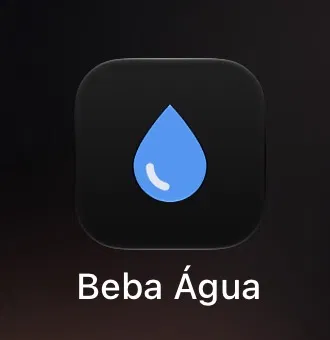
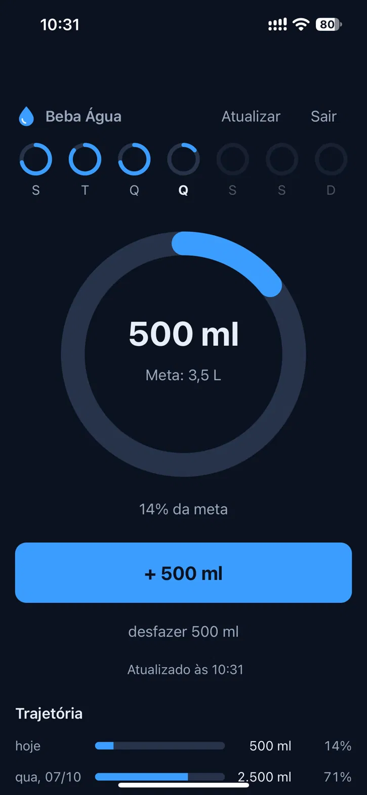
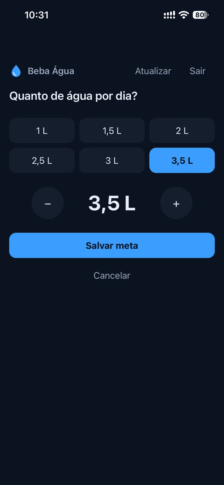
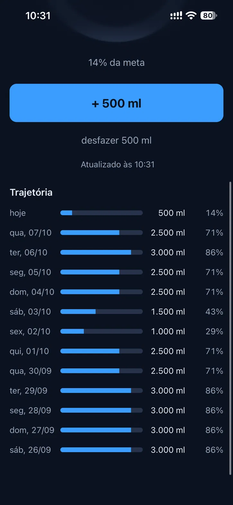

# Beba Água

Contador de água diário projetado para uso direto no celular. Você define a meta uma vez e, na rotina, precisa apenas de um toque: cada clique soma 500 ml ao total do dia.

## Preview no iPhone

O app instalado como atalho na tela de início e em uso no iPhone:

<p align="center">
  
  
  
  
</p>

## Como funciona

- A meta diária vai de 1 L a 3,5 L (em intervalos de 0,5 L), definida no primeiro acesso e ajustável a qualquer momento ao tocar na meta.
- O botão principal adiciona 500 ml por toque ao total do dia.
- Quando a meta é atingida, o anel fecha e fica verde.
- Se o consumo passar da meta, a contagem continua e um arco adicional destaca o volume excedente e o percentual atingido.
- Uma faixa semanal exibe anéis individuais para cada dia, acompanhada do histórico detalhado dos últimos 30 dias.
- O botão de desfazer remove os últimos 500 ml em caso de toque acidental.

## Armazenamento

Os registros ficam salvos em um arquivo `agua.json` na branch `agua-dados` deste repositório, gerenciados diretamente pela API de Contents do GitHub. Cada toque gera um commit nessa branch, mantendo a `main` dedicada exclusivamente ao código da aplicação.

```json
{
  "versao": 1,
  "meta_ml": 3500,
  "dias": {
    "2026-10-05": { "ml": 1500, "meta_ml": 3500 }
  }
}
```

Cada registro diário preserva a meta configurada naquela data, o que mantém o histórico consistente mesmo se a meta for alterada posteriormente.

A leitura inicial ocorre ao abrir a página. A sincronização roda em segundo plano a cada 5 minutos com a tela visível e a cada 15 minutos quando a tela fica em segundo plano, além de recarregar os dados imediatamente ao voltar para o app. Isso mantém os registros sincronizados entre aparelhos diferentes e vira o dia automaticamente sem recarregar a página. Se dois dispositivos salvarem no mesmo intervalo, o app relê o arquivo antes de gravar para evitar perda de dados.

## Acesso

A autenticação utiliza um personal access token do GitHub, armazenado apenas no navegador local.

1. Acesse GitHub > Settings > Developer settings > Personal access tokens > Fine-grained tokens.
2. Clique em Generate new token e restrinja o acesso ao repositório `SamuelAraag/beba-agua`.
3. Em Permissions, selecione Contents com permissão Read and write.
4. Cole o token gerado na tela inicial do app.

O botão Sair remove o token salvo no navegador.

## Execução local

Como não há etapa de build nem dependências externas, basta iniciar um servidor HTTP local:

```bash
python3 -m http.server 8000
```

Em seguida, acesse `http://localhost:8000`.

## Estrutura

```text
index.html
src/style.css
src/app.js       estado, regras e eventos
src/github.js    leitura e gravação via API do GitHub
src/ui.js        anéis, telas e histórico
```

## Status

MVP implementado na branch `mvp`. O planejamento completo está em [PLANO.md](PLANO.md).
